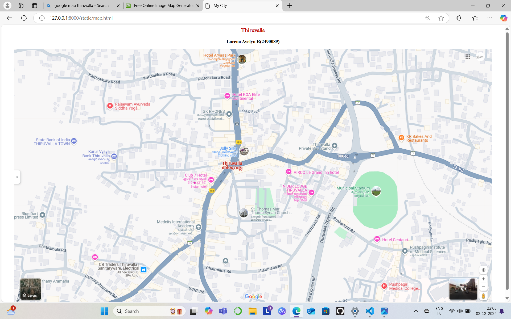
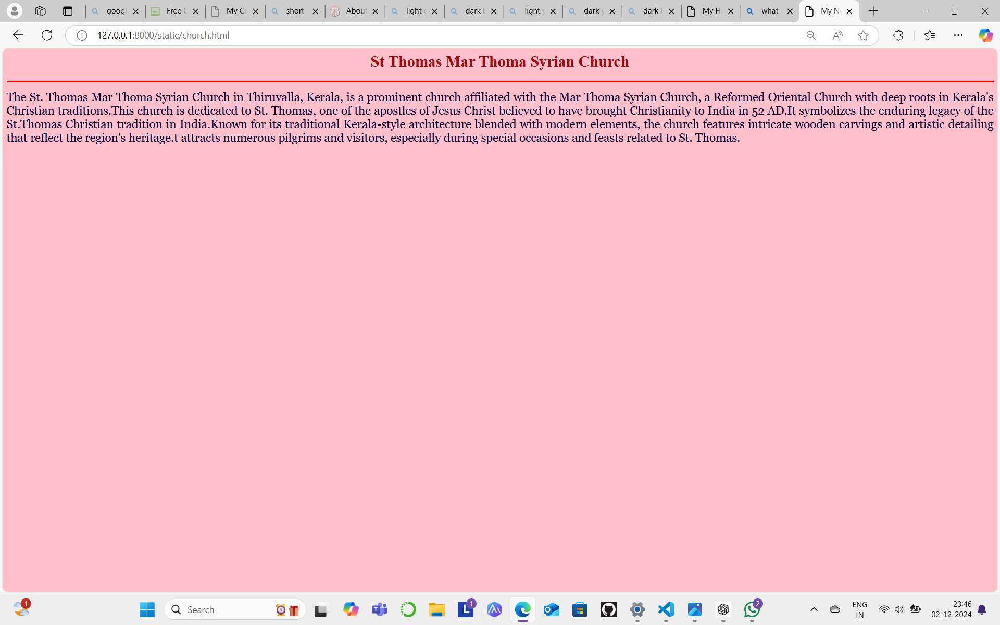
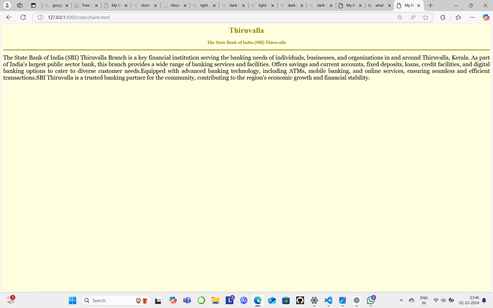
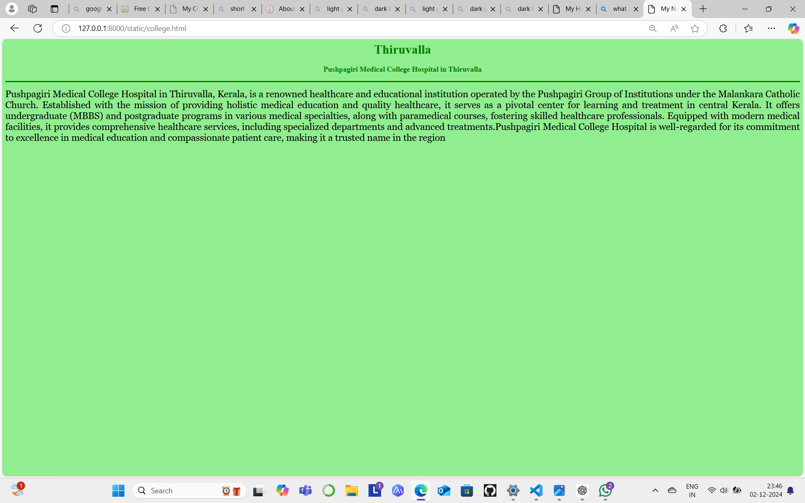
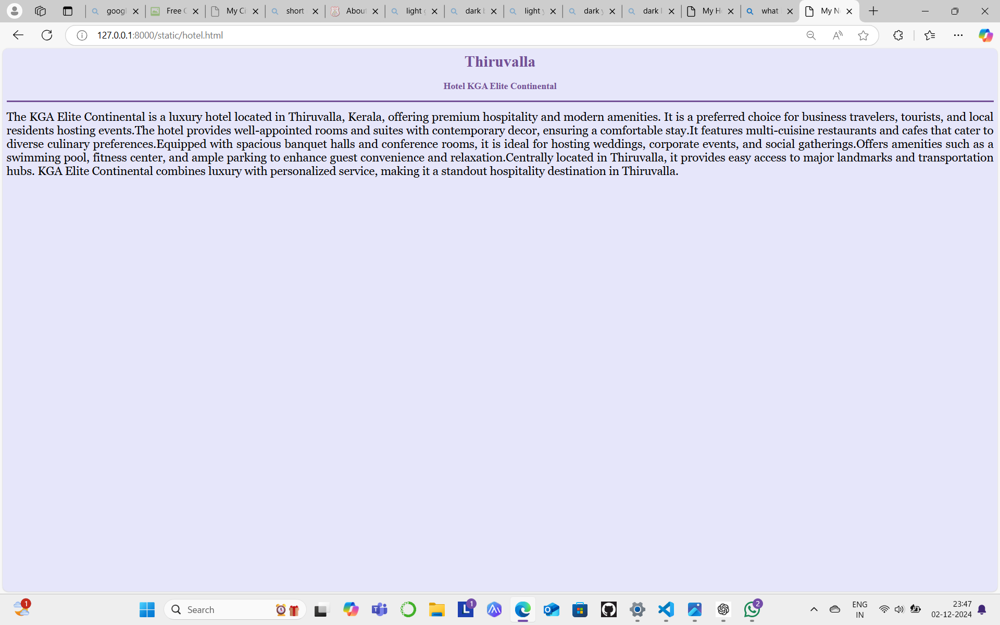
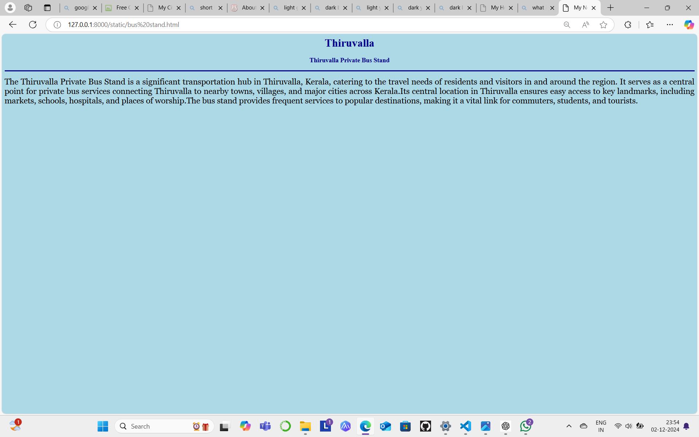

# Ex04 Places Around Me
## Date:02/12/2024

## AIM
To develop a website to display details about the places around my house.

## DESIGN STEPS

### STEP 1
Create a Django admin interface.

### STEP 2
Download your city map from Google.

### STEP 3
Using ```<map>``` tag name the map.

### STEP 4
Create clickable regions in the image using ```<area>``` tag.

### STEP 5
Write HTML programs for all the regions identified.

### STEP 6
Execute the programs and publish them.

## CODE
```
map.html


<html>
<head>
<title>My New City</title>
</head>
<body>
<h1 align="center">
<font color="Baby pink" size="5" face="Garamond Regular"><b>Thiruvalla</b></font>
</h1>
<h3 align="center">
<font color="black"><b>Lorena Avelyn R(2490089)</b></font>
</h3>
<center>

<map name="image-map">
    <area target="" alt="St Thomas Mar Thoma Syrian Church" title="St Thomas Mar Thoma Syrian Church" href="church.html" coords="919,659,54" shape="circle">
    <area target="" alt="Puspagiri Medical College Hospital" title="Puspagiri Medical College Hospital" href="college.html" coords="1484,952,42" shape="circle">
    <area target="" alt="State Bank of India Thiruvalla Town" title="State Bank of India Thiruvalla Town" href="bank.html" coords="240,370,55" shape="circle">
    <area target="" alt="Thiruvalla Private Bus Stand" title="Thiruvalla Private Bus Stand" href="bus stand.html" coords="1283,387,39" shape="circle">
    <area target="" alt="Hotel KGA Elite Continental" title="Hotel KGA Elite Continental" href="hotel.html" coords="855,188,55" shape="circle">
</map>
</map>
</center>
</body>

</html>

hotel.html

<html>
<head>
<title>My New City</title>
</head>
<body bgcolor="E6E6FA">
<h1 align="center">
<font color="734f96"><b>Thiruvalla</b></font>
</h1>
<h3 align="center">
<font color="734f96"><b>Hotel KGA Elite Continental</b></font>
</h3>
<hr size="3" color="734f96">
<p align="justify">
<font face="Georgia" size="5">
The KGA Elite Continental is a luxury hotel located in Thiruvalla, Kerala, offering premium hospitality and modern amenities.
It is a preferred choice for business travelers, tourists, and local residents hosting events.The hotel provides well-appointed 
rooms and suites with contemporary decor, ensuring a comfortable stay.It features multi-cuisine restaurants and cafes that cater
to diverse culinary preferences.Equipped with spacious banquet halls and conference rooms, it is ideal for hosting weddings, 
corporate events, and social gatherings.Offers amenities such as a swimming pool, fitness center, and ample parking to enhance 
guest convenience and relaxation.Centrally located in Thiruvalla, it provides easy access to major landmarks and transportation hubs.
KGA Elite Continental combines luxury with personalized service, making it a standout hospitality destination in Thiruvalla.</font>
</p>
</body>
</html>

church.html

<html>
<head>
<title>My New City</title>
</head>
<body bgcolor="pink">
<h1 align="center">
<font color="navy blue><b>Thiruvalla</b></font>
</h1>
<h3 align="center">
<font color="navy blue"><b>St Thomas Mar Thoma Syrian Church</b></font>
</h3>
<hr size="3" color="red">
<p align="justify">
<font face="Georgia" size="5">
The St. Thomas Mar Thoma Syrian Church in Thiruvalla, Kerala, is a prominent church affiliated with the Mar Thoma Syrian Church,
a Reformed Oriental Church with deep roots in Kerala's Christian traditions.This church is dedicated to St. Thomas, one of the 
apostles of Jesus Christ believed to have brought Christianity to India in 52 AD.It symbolizes the enduring legacy of the St.Thomas 
Christian tradition in India.Known for its traditional Kerala-style architecture blended with modern elements, the church features 
intricate wooden carvings and artistic detailing that reflect the region's heritage.t attracts numerous pilgrims and visitors, 
especially during special occasions and feasts related to St. Thomas.</font>
</p>
</body>
</html>

bus stand.html

<html>
<head>
<title>My New City</title>
</head>
<body bgcolor="ADD8E6">
<h1 align="center">
<font color="00008B"><b>Thiruvalla</b></font>
</h1>
<h3 align="center">
<font color="00008B"><b>Thiruvalla Private Bus Stand</b></font>
</h3>
<hr size="3" color="00008B">
<p align="justify">
<font face="Georgia" size="5">
The Thiruvalla Private Bus Stand is a significant transportation hub in Thiruvalla, Kerala, catering to the travel needs of residents
and visitors in and around the region. It serves as a central point for private bus services connecting Thiruvalla to nearby towns, 
villages, and major cities across Kerala.Its central location in Thiruvalla ensures easy access to key landmarks, including markets,
schools, hospitals, and places of worship.The bus stand provides frequent services to popular destinations, making it a vital link 
for commuters, students, and tourists.</font>
</p>
</body>
</html>

college.html

<html>
<head>
<title>My New City</title>
</head>
<body bgcolor="90EE90">
<h1 align="center">
<font color="green""><b>Thiruvalla</b></font>
</h1>
<h3 align="center">
<font color="green"><b>Pushpagiri Medical College Hospital in Thiruvalla</b></font>
</h3>
<hr size="3" color="green">
<p align="justify">
<font face="Georgia" size="5">
Pushpagiri Medical College Hospital in Thiruvalla, Kerala, is a renowned healthcare and educational institution operated by
the Pushpagiri Group of Institutions under the Malankara Catholic Church. Established with the mission of providing holistic 
medical education and quality healthcare, it serves as a pivotal center for learning and treatment in central Kerala. It offers 
undergraduate (MBBS) and postgraduate programs in various medical specialties, along with paramedical courses, fostering skilled
healthcare professionals. Equipped with modern medical facilities, it provides comprehensive healthcare services, including 
specialized departments and advanced treatments.Pushpagiri Medical College Hospital is well-regarded for its commitment to 
excellence in medical education and compassionate patient care, making it a trusted name in the region.</font>
</p>
</body>
</html>

bank.html

<html>
<head>
<title>My New City</title>
</head>
<body bgcolor="FFFFE0">
<h1 align="center">
<font color=" #9B870C"><b>Thiruvalla</b></font>
</h1>
<h3 align="center">
<font color=" #9B870C"><b>The State Bank of India (SBI) Thiruvalla</b></font>
</h3>
<hr size="3" color=" #9B870C">
<p align="justify">
<font face="Georgia" size="5">
The State Bank of India (SBI) Thiruvalla Branch is a key financial institution serving the banking needs of individuals,
businesses, and organizations in and around Thiruvalla, Kerala. As part of India's largest public sector bank, this branch 
provides a wide range of banking services and facilities. Offers savings and current accounts, fixed deposits, loans, credit
facilities, and digital banking options to cater to diverse customer needs.Equipped with advanced banking technology, including
ATMs, mobile banking, and online services, ensuring seamless and efficient transactions.SBI Thiruvalla is a trusted banking partner
for the community, contributing to the region's economic growth and financial stability.</font>
</p>
</body>
</html>
```


## OUTPUT







## RESULT
The program for implementing image maps using HTML is executed successfully.
